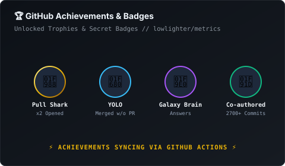

<div align="center">

  <!-- Animated Hero Banner -->
  <a href="https://github.com/tachyon-ops">
    
  </a>

  <!-- Animated Typing Subtitle -->
  <a href="https://github.com/tachyon-ops">
    
  </a>

  <p>
    <a href="https://github.com/tachyon-ops?tab=repositories">
      
    </a>
    <a href="https://github.com/tachyon-ops">
      
    </a>
    <a href="https://github.com/tachyon-ops">
      
    </a>
    
  </p>

</div>

---

### 📡 Sheikah Slate // Chrono-Terminal HUD

```yaml
┌──[ Chrono-Terminal // Link @ tachyon-ops ]
│  🛡️ Class       : Senior Systems Architect & Reactive UI Alchemist
│  ⏳ Veteran Rank : 15 Earth Years on GitHub (Active since 2011)
│  📍 Coordinates  : Zurich, Switzerland (Europe/Zurich)
│  ⚔️ Relics       : Master Sword (Rust) • Sheikah Slate (TypeScript / React)
│  🧪 Prime Focus  : High-performance compilers, reactive UI engines & seamless interop
│  ⚡ Warp Status  : 100% Core Output | All Systems Nominal
└──[ Transmission  : "It's dangerous to code alone! Take this." ]
```

---

### 🐍 The Chrono-Snake

<div align="center">
  <picture>
    <source media="(prefers-color-scheme: dark)" srcset="assets/github-snake-dark.svg" />
    <source media="(prefers-color-scheme: light)" srcset="assets/github-snake.svg" />
    
  </picture>
</div>

---

### ⚔️ Active Quests & Standout Inventions

<table>
  <tr>
    <td width="50%" valign="top">
      <h4>🦀 <a href="https://github.com/tachyon-ops/ruinx">ruinx</a></h4>
      <p>A daring, high-velocity experiment to create a native <strong>Rust UI engine using JSX syntax</strong>. Pushing the boundaries of compile-time ergonomic GUI development.</p>
      <p>
        
        
      </p>
    </td>
    <td width="50%" valign="top">
      <h4>⚡ <a href="https://github.com/tachyon-ops/react_vue_ts">react_vue_ts</a></h4>
      <p><strong>Vuera TypeScript</strong> interoperability library. Seamlessly mount and pass state between React and Vue components with rigorous type safety.</p>
      <p>
        
        
      </p>
    </td>
  </tr>
  <tr>
    <td width="50%" valign="top">
      <h4>🛡️ <a href="https://github.com/tachyon-ops/csts">csts</a></h4>
      <p>Strict type-level utilities and architectural helpers engineered for scalable modern TypeScript codebases.</p>
      <p>
        
      </p>
    </td>
    <td width="50%" valign="top">
      <h4>💫 <a href="https://github.com/tachyon-ops/kiss-react-state">kiss-react-state</a></h4>
      <p>Zero-bloat, elegant state management following the classic <em>Keep It Simple, Stupid</em> philosophy.</p>
      <p>
        
      </p>
    </td>
  </tr>
</table>

---

### 🎒 Weapon Arsenal & Tech Inventory

<div align="center">

#### Systems & Core Engines


#### Reactive UI & Web Frontend


#### Tooling, Cloud & Runtimes


</div>

---

### 📊 Combat & Mastery Analytics

<div align="center">
  <table border="0">
    <tr>
      <td width="50%" align="center">
        
      </td>
      <td width="50%" align="center">
        
      </td>
    </tr>
  </table>
</div>

---

### 🌌 Deep Metrics & Chrono-Infographics

<div align="center">

  <!-- Core Metrics & Languages & Habits -->
  

  <br/><br/>

  <!-- 3D Isometric Calendar & Badges side-by-side -->
  <table border="0">
    <tr>
      <td width="50%" align="center" valign="top">
        
      </td>
      <td width="50%" align="center" valign="top">
        
      </td>
    </tr>
  </table>

</div>

---

<div align="center">
  <sub>⚡ Powered by <strong>lowlighter/metrics</strong> &amp; <strong>Platane/snk</strong> • Crafted with Tachyon Warp Speed // 2026</sub>
</div>
