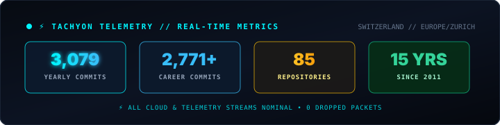

<div align="center">

  <!-- Animated Hero Banner -->
  <a href="https://github.com/tachyon-ops">
    
  </a>

  <!-- Animated Typing Subtitle -->
  <a href="https://github.com/tachyon-ops">
    
  </a>

  <p>
    <a href="https://github.com/tachyon-ops?tab=repositories">
      
    </a>
    <a href="https://github.com/tachyon-ops">
      
    </a>
    <a href="https://github.com/tachyon-ops">
      
    </a>
    
  </p>

</div>

---

### 📡 Telemetry Station // Chrono-Terminal HUD

```yaml
┌──[ Tachyon Telemetry Station // Link @ tachyon-ops ]
│  ⚡ Role         : Head of Cloud & Telemetry Architect
│  🚀 Throughput   : High-Throughput Reactive Streams (Millions of Telemetry Events/sec)
│  🌐 Protocols    : LoRaWAN • SiLA 2 (Lab Automation) • MQTT • WebSockets • gRPC
│  🧊 Graphics     : Extreme Performance 2D & 3D Canvas (1M+ Data Points / Dots at 60 FPS)
│  🏛️ Domains      : Industrial IoT • Smart Meter Systems • Fintech Telemetry • Lab Robotics
│  🇺🇳 Global Duty  : UN Volunteer — United Nations Development Programme (UNDP Tech Radar)
│  ⚔️ Core Relics  : Rust (Master Sword) • WebGPU / WASM • Go • C++ • TypeScript
│  🔋 System State : 100% Core Nominal | Fueled by Hard, Impossible Engineering Challenges
└──[ Transmission  : "If it doesn't push the hardware to its limits, it's not fast enough." ]
```

---

### 🌍 Global Humanitarian Impact & UN Volunteering

<table>
  <tr>
    <td width="100%">
      <div align="left">
        <h3>🇺🇳 <a href="https://drrtechradar.org/">Frontier Technology Radar (FTR4DRR)</a> // United Nations Development Programme</h3>
        <p>
          Volunteer initiative for the <strong>United Nations (UNDP)</strong>, in partnership with the <strong>SDG AI Lab</strong> and the <strong>Connecting Business initiative (CBi)</strong>. Engineered an interactive, multi-horizon <strong>Technology Radar Engine</strong> to systematically map, evaluate, and track emerging frontier technologies (AI, IoT, Drones, GIS) across disaster risk reduction, crisis response, and global humanitarian development horizons.
        </p>
        <p>
          <a href="https://drrtechradar.org/">
            
          </a>
          <a href="https://github.com/SDG-AI-Lab/Digital_Technologies_Radar">
            
          </a>
          <a href="https://www.npmjs.com/package/undp-radar">
            
          </a>
          <a href="https://github.com/tachyon-ops/undp-radar">
            
          </a>
        </p>
        
        <details>
          <summary><strong>📦 View <code>undp-radar</code> Library Architecture &amp; Quickstart</strong></summary>
          <br/>
          <p>The library provides an ergonomic React + D3 multi-horizon radar generator designed for extreme visual clarity across complex multi-quadrant datasets:</p>

```bash
npm install undp-radar
# or
yarn add undp-radar
```

```tsx
import React from 'react';
import { RadarProvider, DataProvider, RadarApp, RadarDataGenerator } from 'undp-radar';
import 'undp-radar/dist/index.css';

export const UNTechRadar: React.FC = () => (
  <RadarProvider>
    <DataProvider>
      <RadarDataGenerator />
      {/* High-performance multi-horizon radar rendering */}
      <RadarApp />
    </DataProvider>
  </RadarProvider>
);
```
        </details>
      </div>
    </td>
  </tr>
</table>

---

### 🇨🇭 Zurich Tech Ecosystem & Events Radar

<div align="center">
  <table>
    <tr>
      <td width="25%" align="center">
        <h4>🦀 <a href="https://rust-zuerisee.ch/">Rust Zürisee</a></h4>
        <p>Premier Zurich Rust developer meetups &amp; deep-tech systems discussions.</p>
        <a href="https://www.meetup.com/Rust-Zuerisee/"></a>
      </td>
      <td width="25%" align="center">
        <h4>🤖 <a href="https://ai-x-summit.ethz.ch/">AI+X Summit</a></h4>
        <p>Flagship Swiss AI, ML &amp; Systems summit hosted at StageOne, Oerlikon.</p>
        
      </td>
      <td width="25%" align="center">
        <h4>🏔️ <a href="https://swissdevjobs.ch/tech-events-switzerland">SwissDev Events</a></h4>
        <p>Curated radar for developer conferences, hackathons, and cloud summits.</p>
        
      </td>
      <td width="25%" align="center">
        <h4>⚡ <a href="https://www.startupticker.ch/">Startupticker.ch</a></h4>
        <p>National hub for Swiss deep-tech innovation, IoT, and high-frequency news.</p>
        
      </td>
    </tr>
  </table>
  <sub>📍 Based in Zurich, Switzerland. Always excited to meet fellow engineers building high-throughput systems, low-latency telemetry, or 3D graphics!</sub>
</div>

---

<!-- CONNECT4_START -->
<div align="center">

### 🎮 Community vs Link Bot // Connect Four

| [1](https://github.com/tachyon-ops/tachyon-ops/issues/new?title=connect4|drop|red|1&body=Click+'Submit+new+issue'+to+drop+your+disc+in+Column+1!+Link+Bot+will+respond+automatically.) | [2](https://github.com/tachyon-ops/tachyon-ops/issues/new?title=connect4|drop|red|2&body=Click+'Submit+new+issue'+to+drop+your+disc+in+Column+2!+Link+Bot+will+respond+automatically.) | [3](https://github.com/tachyon-ops/tachyon-ops/issues/new?title=connect4|drop|red|3&body=Click+'Submit+new+issue'+to+drop+your+disc+in+Column+3!+Link+Bot+will+respond+automatically.) | [4](https://github.com/tachyon-ops/tachyon-ops/issues/new?title=connect4|drop|red|4&body=Click+'Submit+new+issue'+to+drop+your+disc+in+Column+4!+Link+Bot+will+respond+automatically.) | [5](https://github.com/tachyon-ops/tachyon-ops/issues/new?title=connect4|drop|red|5&body=Click+'Submit+new+issue'+to+drop+your+disc+in+Column+5!+Link+Bot+will+respond+automatically.) | [6](https://github.com/tachyon-ops/tachyon-ops/issues/new?title=connect4|drop|red|6&body=Click+'Submit+new+issue'+to+drop+your+disc+in+Column+6!+Link+Bot+will+respond+automatically.) | [7](https://github.com/tachyon-ops/tachyon-ops/issues/new?title=connect4|drop|red|7&body=Click+'Submit+new+issue'+to+drop+your+disc+in+Column+7!+Link+Bot+will+respond+automatically.) |
| --- | --- | --- | --- | --- | --- | --- |
| ⚪ | ⚪ | ⚪ | ⚪ | ⚪ | ⚪ | ⚪ |
| ⚪ | ⚪ | ⚪ | ⚪ | ⚪ | ⚪ | ⚪ |
| ⚪ | ⚪ | ⚪ | ⚪ | ⚪ | ⚪ | ⚪ |
| ⚪ | ⚪ | ⚪ | ⚪ | ⚪ | ⚪ | ⚪ |
| ⚪ | ⚪ | ⚪ | ⚪ | ⚪ | ⚪ | ⚪ |
| ⚪ | ⚪ | ⚪ | ⚪ | ⚪ | ⚪ | ⚪ |

<br/>

🔴 **Your turn! Click a column number above [1–7] to drop a Red disc.** • [Reset](https://github.com/tachyon-ops/tachyon-ops/issues/new?title=connect4|reset&body=Click+'Submit+new+issue'+to+reset+the+game+board!)

<br/>

<p>
  
  
  
  
</p>

<sub>Clicking a column opens a pre-filled GitHub Issue. Submitting it triggers a GitHub Action that plays your move and Link Bot's counter-move in ~15 seconds.</sub>

</div>
<!-- CONNECT4_END -->

---

### 🐍 The Chrono-Snake Eating Contributions

<div align="center">
  <picture>
    <source media="(prefers-color-scheme: dark)" srcset="https://raw.githubusercontent.com/tachyon-ops/tachyon-ops/master/assets/github-snake-dark.svg" />
    <source media="(prefers-color-scheme: light)" srcset="https://raw.githubusercontent.com/tachyon-ops/tachyon-ops/master/assets/github-snake.svg" />
    
  </picture>
</div>

---

### ⚔️ High-Throughput Systems & Standout Inventions

<table>
  <tr>
    <td width="50%" valign="top">
      <h4>🦀 <a href="https://github.com/tachyon-ops/ruinx">ruinx</a></h4>
      <p>A daring, high-velocity experiment to create a native <strong>Rust UI engine using JSX syntax</strong>. Pushing compile-time ergonomics for high-performance native user interfaces.</p>
      <p>
        
        
      </p>
    </td>
    <td width="50%" valign="top">
      <h4>📡 <a href="https://github.com/tachyon-ops/react_radar">react_radar</a></h4>
      <p>Proprietary <strong>multi-dimensional interactive radar tech</strong> for dense data distribution and high-throughput real-time spatial event monitoring.</p>
      <p>
        
        
      </p>
    </td>
  </tr>
  <tr>
    <td width="50%" valign="top">
      <h4>⚡ <a href="https://github.com/tachyon-ops/react_vue_ts">react_vue_ts</a></h4>
      <p><strong>Vuera TypeScript</strong> interoperability library. High-performance bidirectional mounting and state synchronization between React and Vue runtimes with zero type compromise.</p>
      <p>
        
        
      </p>
    </td>
    <td width="50%" valign="top">
      <h4>⛓️ <a href="https://github.com/tachyon-ops/rust_pos_blockchain">rust_pos_blockchain</a></h4>
      <p>High-concurrency <strong>Proof-of-Stake blockchain engine</strong> built in Rust with real-time WebSocket telemetric feeds and distributed p2p state broadcast.</p>
      <p>
        
        
      </p>
    </td>
  </tr>
</table>

---

### 🎒 Weapon Arsenal // Cloud, Telemetry & Graphics Mastery

<div align="center">

#### Cloud, Distributed Systems & Telemetry Protocols


#### High-Performance & Low-Level Compute


#### Million-Dot 2D/3D Graphics & Real-Time Dashboards


#### Mission-Critical Domains


</div>

---

### 📊 Combat & Streak Telemetry

<div align="center">
  <a href="https://github.com/tachyon-ops">
    
  </a>
</div>

---

### 🌌 Deep Metrics & Chrono-Infographics

<div align="center">

  <!-- Core Metrics & Languages & Habits -->
  

  <br/><br/>

  <!-- 3D Isometric Commit Calendar -->
  

</div>

---

<div align="center">
  <sub>⚡ Powered by <strong>lowlighter/metrics</strong> &amp; <strong>Platane/snk</strong> • Engineered with Tachyon Warp Speed // 2026</sub>
</div>